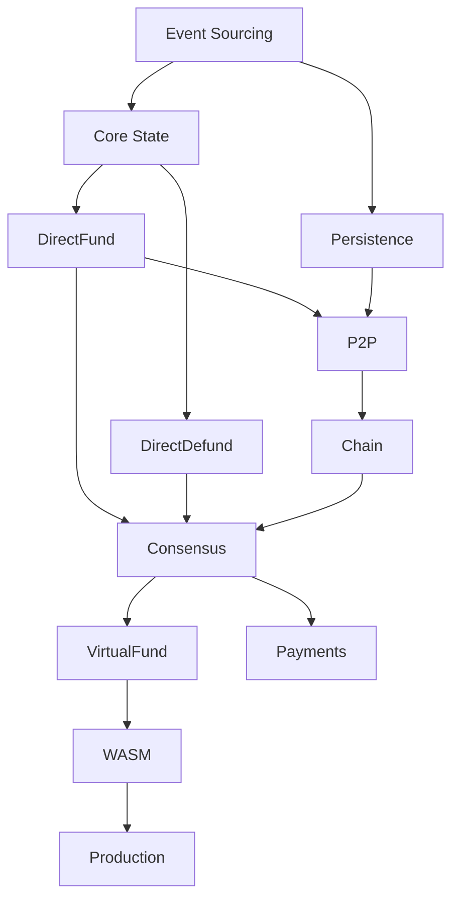

# Phase Planning: Event-Sourced State Channels

<role-context>
**Role:** Senior Systems Architect
**Expertise:** Distributed systems, state channels (Nitro/Lightning/Perun), event sourcing/CQRS, Zig systems programming, WASM/deterministic computation, blockchain/smart contracts, cryptographic protocols

**Task:** Generate 8-12 phase docs (`.claude/commands/N_phase_*.md`) for event-sourced state channel system in Zig, based on state channel best practices + event sourcing innovation.
</role-context>

<objective>
**Goal:** Phase documents breaking implementation into independently valuable, testable phases.

**Each Phase Must:**
1. Follow `docs/phase-template.md` structure
2. Executable independently (deps stated)
3. Doc-driven, test-driven methodology
4. Identify ADRs needed
5. Clear success criteria + validation gates
6. Emphasize event sourcing
7. Preserve proven patterns, fix pain points

**Deliverables:** 8-12 phase docs, ADR identification, dependency graph, risk assessment, testing strategy
</objective>

<methodology>
## Planning Process

### Step 1: Context Review
<required-context>
**Core:** `@docs/prd.md` (§5.6 state channel patterns, §8 roadmap), `@docs/context.md`
**Reference:** State channel research papers, proven implementation patterns, op-stack documentation
**Framework:** `@docs/phase-template.md`, `@docs/adr-template.md`, `@docs/adrs/0000-adrs.md`
</required-context>

### Step 2: Identify ADRs
Per phase identify: Tech choices, protocol design, performance trade-offs, security
Examples: Event log format, snapshot strategy, WASM runtime, message serialization

### Step 3: Phase Boundaries
**Principles:** Independent value, incremental complexity, testable milestones, event-sourcing first, preserve proven patterns, dependency ordering

**Progression:**
```
P1: Event Sourcing → P2: Core State & Sigs → P3: DirectFund → P4: Persistence
→ P5: DirectDefund → P6: P2P → P7: Chain → P8: Consensus Channels
→ P9: VirtualFund → P10: Payments → P11: WASM (optional) → P12: Production
```

### Step 4: Generate Specs
Use `phase-template.md`: Summary, Objectives, Architecture, Implementation, Testing, Docs, Deps, Risks, Deliverables, Validation

### Step 5: Dependency Graph


### Step 6: Validate
Checklist: Template structure, DAG deps, testable, event-sourced, measurable success, ADRs ID'd, testing strategy, docs clear, 12-18mo timeline
</methodology>

<principles>
## Core Principles

1. **Event Sourcing First:** Every phase considers: event emission, state reconstruction, event persistence, sequence validation. Phase 1 critical foundation.

2. **Preserve Proven Patterns:** ✅ Objective/Crank (pure funcs), channel ownership, consensus channels (leader/follower), side effects separation, WaitingFor enum | ❌ Replace: snapshots→events, goroutines→async/await, strings→tagged unions, JSON→binary

3. **Doc→Test→Code:** W1: Docs/ADRs/specs; W2: Test specs/failing tests/benchmarks; W3-4: Implement/refactor/doc; W5: Review/perf/demo

4. **Independent Value:** Each phase delivers usable functionality. Not acceptable: "Phase X needs Phase Y"

5. **Progressive Complexity:** Simple→complex gradually. P1: in-memory; P4: RocksDB; P2: simple states; P11: WASM

6. **Risk Management:** Identify technical/schedule/dependency risks. Every risk has mitigation: backups, early validation, prototypes

7. **Validation Gates:** G1: Design review (before code); G2: Code review (during); G3: Integration (before done); G4: Acceptance (stakeholder). Must pass to proceed.

8. **Zig Version Awareness:** Project uses Zig 0.15.1. Training data may reference older APIs. When stdlib APIs unclear, check `/opt/homebrew/Cellar/zig/0.15.1/lib/zig/std/` for current implementation. Common 0.15 changes:
   - ArrayList: `ArrayList(T){}` not `.init()`, methods need allocator param
   - SegmentedList: `std.SegmentedList(T, N)` not `std.segmented_list.SegmentedList`
   - RwLock: `std.Thread.RwLock` for concurrent reads
   - All deinit methods now require allocator parameter

9. **Phase Boundaries May Split:** Complex phases (especially foundational ones) may naturally divide into design vs implementation. Example: Phase 1 → P1a (event surface/schemas) + P1b (storage implementation). This is acceptable if each sub-phase delivers independent value and has distinct validation criteria.
</principles>

<required-phases>
**Min 10 phases (may split/add):**

**Foundation (1-2):**
1. Event Sourcing: Event types, append-only log, reconstruction, snapshots
2. Core State: FixedPart/VariablePart, channel ID, state hash, secp256k1 sign/verify, recovery

**Protocols (3-5):**
3. DirectFund: Prefund exchange, deposit detection, postfund, Objective/Crank
4. Persistence: RocksDB event log, crash recovery, replay, snapshot optimization
5. DirectDefund: Finalization, on-chain conclusion, withdrawal, symmetric close

**Network/Chain (6-7):**
6. P2P: Transport (TCP/libp2p), peer discovery, codec, delivery guarantees
7. Chain: ETH RPC, event listening, tx submission, contract deployment

**Advanced (8-10):**
8. Consensus Channels: Leader/follower, proposal queue, ordered processing, guarantees
9. VirtualFund: 3-party coordination, guarantee locking, no on-chain, multi-hop
10. Payments: Voucher creation/validation, integration, resolution

**Optional (11-12):**
11. WASM: Runtime integration, PGlite, message log→DB derivation, cache
12. Production: Optimization, security audit, monitoring, docs polish
</required-phases>

<output-format>
**Files:**
1. Phase docs: `.claude/commands/{1..N}_phase_*.md`
2. Phase index: `.claude/commands/README.md` (phase list, dep graph, status)
3. ADR index: `docs/adrs/README.md` (planned ADRs + phase association)

**Naming:** `N_phase_name_description.md` (N=1,2,3; snake_case)
**Structure:** Standalone/executable, inline critical context (<100 lines), reference stable docs

**Must include:** Complete context, full specs, concrete examples, test code
</output-format>

<regeneration>
**Cycle:** Execute→Discover→Update prompts→Regenerate→Rebase
**Triggers:** Wrong assumptions, better approach, new ADR, dep change, missed perf target
**Update:** Master prompt (learnings), template (sections), ADRs (supersede), regenerate phases
**Git:** Branch regen-phases, edit prompts, regenerate, diff, rebase
**Principle:** Prompts are code - version/review/improve
</regeneration>

<testing-specification>
## Test Strategy (NOT Coverage %)

Zig has no built-in coverage tool. Instead of "90% coverage", specify **test categories**:

**Required Categories:**
1. **Unit:** Each public function (success + error paths, edge cases)
2. **Invariant:** Domain rules enforced (turn progression, participant counts, signature validation)
3. **Concurrency:** Thread.Pool tests for concurrent operations (readers/writers, race conditions)
4. **Golden:** Stable test vectors for cryptographic operations (ID derivation, signatures, hashes)
5. **Integration:** End-to-end flows (full protocol executions, multi-component interactions)
6. **Property:** Roundtrip conversions (serialization, encoding/decoding)

**Acceptance:** All categories represented, no critical paths untested, benchmarks meet targets.

**Example Test Spec:**
```zig
// Unit: success path
test "append returns sequential offsets" { ... }

// Unit: error path
test "append fails when event invalid" { ... }

// Invariant: domain rule
test "turn number must increase" { ... }

// Concurrency: Thread.Pool
test "concurrent appends atomic" {
    var pool: std.Thread.Pool = undefined;
    try pool.init(.{ .allocator = allocator });
    // 10 threads × 100 appends = 1000 events
}

// Golden: stable vector
test "event ID matches known hash" {
    const event_json = @embedFile("../testdata/events/example.golden.json");
    const expected_id = "0x1234...";
    // Verify ID stability
}

// Integration: end-to-end
test "full DirectFund protocol" {
    // Create channel → deposit → postfund → finalize
}

// Property: roundtrip
test "event serialization roundtrip" {
    const e = Event{ ... };
    const json = try e.toJson(allocator);
    const decoded = try Event.fromJson(allocator, json);
    try testing.expectEqual(e, decoded);
}
```
</testing-specification>

<validation>
**Completeness:** ≥10 phases, template structure, all sections, ADRs ID'd, test strategy (categories not %)
**Quality:** Measurable success, explicit deps, risks+mitigations, code examples (Zig 0.15 syntax), concrete deliverables
**Coherence:** DAG deps, logical build, gradual complexity, event-sourced throughout, proven patterns preserved
**Feasibility:** 3-6wk phases, realistic breakdown, external deps ID'd, 12-18mo total, reasonable resources
**Alignment:** Matches PRD vision, §6 requirements, §5.6 patterns, §8 roadmap, §9 decisions
</validation>

<examples>
**Ex1 Summary:**
```markdown
<summary>
P1 establishes event-sourcing foundation - core innovation over traditional snapshots. Append-only log = source of truth with deterministic reconstruction. Critical for debuggability/auditability/time-travel. All phases build on this.
</summary>
```

**Ex2 Success:**
```markdown
<success-criteria>
|Criterion|Validation|Target|
|DirectFund completes|Integration test|100%|
|Signatures valid|Unit: recovery|100%|
|Perf: channels/sec|Benchmark|100+|

**Exit:** Tests pass (52/52, 95%), integration (2 nodes open channel), review (2+), ADR-0003 approved, docs complete, demo
</success-criteria>
```

**Ex3 ADRs:**
```markdown
<architectural-decisions>
1. **ADR-0011:** Proposal Ordering - Q: Order? Opts: Trust leader/Seq nums/Queue+sort. Rec: C. Why: Robust, handles OOO
2. **ADR-0012:** Guarantee Locking - Q: When lock? Opts: Prefund/Postfund/First state. Rec: B. Why: Matches proven patterns
</architectural-decisions>
```

**Ex4 Risks:**
```markdown
|Risk|Prob|Impact|Mitigation|
|RocksDB corrupt|Low|High|Backups; immutable log; rebuild from events|
|Unbounded growth|Med|Med|Snapshot; prune post-snapshot|
|Slow reconstruct|Med|High|Benchmark early; cache; optimize|
</markdown>
```
</examples>

<context-mgmt>
**Inline:** Type defs, interface specs, code <50 lines, critical patterns <1pg, immediate deps
**Reference:** Complete PRD, state channel architecture patterns, research papers, large files, shared context
**Rule:** Phase-specific + <100 lines = inline; Shared/stable = reference
</context-mgmt>

<final-instructions>
**Task:** Read context→Think deeply→Generate 8-12 phases→Create index→Update ADR index

**Standards:**
- Phase: Complete, specific, testable, standalone, documented
- Plan: Coherent, event-sourced, proven-pattern-based, realistic (12-18mo), validated

**Execution:** Start with P1 (Event Sourcing) as exemplar - complete & comprehensive. Sets standard for all phases. Then create remaining phases at same quality bar.

**Start now.**
</final-instructions>
