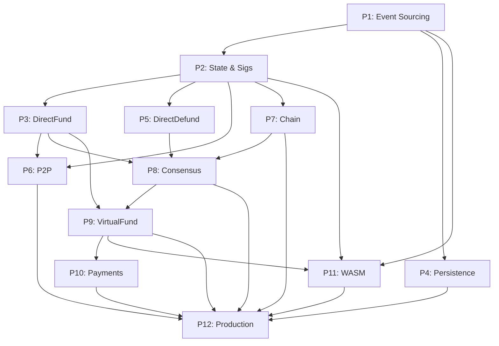

# Phase Planning Index

**Project:** Event-Sourced State Channels in Zig
**Total Phases:** 12 (10 required + 2 optional/polish)
**Estimated Timeline:** 12-18 months
**Status:** Planning Complete

---

## Phase Overview

| # | Phase Name | Duration | Dependencies | Priority | Status |
|---|------------|----------|--------------|----------|--------|
| **1** | [Event Sourcing Foundation](./1_phase_1_event_sourcing.md) | 4-5 wk | None | P0 | Planning |
| **2** | [Core State & Signatures](./2_phase_core_state_and_signatures.md) | 3-4 wk | P1 | P0 | Planning |
| **3** | [DirectFund Protocol](./3_phase_directfund_protocol.md) | 4 wk | P1, P2 | P0 | Planning |
| **4** | [Durable Persistence](./4_phase_durable_persistence.md) | 3 wk | P1 | P0 | Planning |
| **5** | [DirectDefund Protocol](./5_phase_directdefund_protocol.md) | 2 wk | P2, P3 | P0 | Planning |
| **6** | [P2P Networking](./6_phase_p2p_networking.md) | 3 wk | P2, P3 | P0 | Planning |
| **7** | [Chain Service](./7_phase_chain_service.md) | 3 wk | P2, P3 | P0 | Planning |
| **8** | [Consensus Channels](./8_phase_consensus_channels.md) | 4 wk | P2, P3, P5, P7 | P0 | Planning |
| **9** | [VirtualFund/Defund](./9_phase_virtualfund_defund.md) | 4 wk | P3, P5, P8 | P0 | Planning |
| **10** | [Payments](./10_phase_payments.md) | 2 wk | P9 | P0 | Planning |
| **11** | [WASM Derivation](./11_phase_wasm_derivation.md) | 6 wk | P1, P2, P9 | P1 | Planning |
| **12** | [Production Hardening](./12_phase_production_hardening.md) | 6 wk | All | P1 | Planning |

**Priority:**
- **P0:** Must-have (core functionality)
- **P1:** Should-have (innovation + production-ready)

---

## Dependency Graph

---

## Timeline (Estimated)

### Months 1-2: Foundation
- **Phase 1:** Event Sourcing (4-5 weeks)
- **Phase 2:** Core State & Signatures (3-4 weeks)

**Milestone:** Event-sourced state structures with cryptographic signatures

---

### Months 3-4: First Protocol + Persistence
- **Phase 3:** DirectFund Protocol (4 weeks)
- **Phase 4:** Durable Persistence (3 weeks, parallel with P3)

**Milestone:** Funded channels with crash recovery

---

### Months 5-6: Infrastructure
- **Phase 5:** DirectDefund Protocol (2 weeks)
- **Phase 6:** P2P Networking (3 weeks)
- **Phase 7:** Chain Service (3 weeks, parallel with P6)

**Milestone:** Complete direct channel lifecycle over real network + Ethereum

---

### Months 7-9: Advanced Protocols
- **Phase 8:** Consensus Channels (4 weeks)
- **Phase 9:** VirtualFund/Defund (4 weeks)
- **Phase 10:** Payments (2 weeks)

**Milestone:** Virtual channels + payment vouchers (full state channel stack)

---

### Months 10-12: Innovation + Production (Optional)
- **Phase 11:** WASM Derivation (6 weeks, optional)
- **Phase 12:** Production Hardening (6 weeks)

**Milestone:** Application framework + production-ready system

---

## Phase Summaries

### **Phase 1: Event Sourcing Foundation** (4-5 weeks)
Core innovation - append-only event log as source of truth. Establishes event types, EventStore, state reconstruction, snapshots. All subsequent phases build on this.

**Key Deliverables:** EventStore, event types, reconstruction engine, snapshots
**Success Criteria:** 90%+ test coverage, <100ms reconstruction for 1000 events
**ADRs:** 0001 (Event Sourcing), 0002 (Serialization), 0003 (In-Memory)

---

### **Phase 2: Core State & Signatures** (3-4 weeks)
Channel state primitives - State/FixedPart/VariablePart structures, secp256k1 signatures, ABI encoding, ChannelId generation. Required by all protocols.

**Key Deliverables:** State types, signature operations, ABI encoder
**Success Criteria:** Encoding matches reference implementations byte-for-byte, signatures verify
**ADRs:** 0004 (Signature scheme), 0005 (ABI encoding)

---

### **Phase 3: DirectFund Protocol** (4 weeks)
First complete protocol - Objective/Crank pattern, prefund/deposit/postfund flow. Template for all subsequent protocols.

**Key Deliverables:** Objective interface, DirectFundObjective, mock services
**Success Criteria:** 2-party channel funding completes end-to-end
**ADRs:** 0006 (Objective pattern), 0007 (Side effects)

---

### **Phase 4: Durable Persistence** (3 weeks)
RocksDB-backed event storage - crash recovery, snapshots for performance, WAL for atomicity. Production durability.

**Key Deliverables:** DurableEventStore, SnapshotManager, recovery logic
**Success Criteria:** Crash recovery preserves state, <1s startup with 10K events
**ADRs:** 0008 (RocksDB), 0009 (Snapshot frequency)

---

### **Phase 5: DirectDefund Protocol** (2 weeks)
Channel closing - finalization, on-chain conclusion, withdrawal. Completes direct channel lifecycle.

**Key Deliverables:** DirectDefundObjective, conclusion transaction
**Success Criteria:** Cooperative close completes, assets withdrawn
**ADRs:** None (reuses existing patterns)

---

### **Phase 6: P2P Networking** (3 weeks)
Message exchange infrastructure - TCP transport, MessagePack codec, peer connections, delivery guarantees.

**Key Deliverables:** P2PService, message codec, transport layer
**Success Criteria:** DirectFund completes over network between 2 real nodes
**ADRs:** 0010 (Transport), 0011 (Codec)

---

### **Phase 7: Chain Service** (3 weeks)
Ethereum integration - RPC client, event listening, transaction submission, reorg handling.

**Key Deliverables:** ChainService, RPC client, event listener
**Success Criteria:** Deposit detected, conclusion tx submitted correctly
**ADRs:** 0012 (Confirmation depth)

---

### **Phase 8: Consensus Channels** (4 weeks)
Ledger channels with leader/follower - proposal queue, guarantee management. Required for virtual channels.

**Key Deliverables:** ConsensusChannel, GuaranteeManager, leader/follower logic
**Success Criteria:** Guarantees added/removed correctly, proposals ordered
**ADRs:** 0013 (Proposal ordering), 0014 (Guarantee locking)

---

### **Phase 9: VirtualFund/Defund** (4 weeks)
3-party virtual channels - no on-chain txs beyond ledgers, multi-hop support, guarantee coordination.

**Key Deliverables:** VirtualFundObjective, 3-party coordination, multi-hop
**Success Criteria:** Alice-Hub-Bob virtual channel works, 0 on-chain txs
**ADRs:** 0015 (Multi-hop routing)

---

### **Phase 10: Payments** (2 weeks)
Payment vouchers - signed commitments, validation, accumulation, resolution during defund.

**Key Deliverables:** Voucher, VoucherManager, PaymentResolver
**Success Criteria:** Vouchers validated, payments resolved correctly
**ADRs:** None (simple extension)

---

### **Phase 11: WASM Derivation** (6 weeks, optional)
Core innovation - message log → WASM reducer → PostgreSQL state. Enables rich applications beyond payments.

**Key Deliverables:** WasmRuntime, PGlite integration, DerivationEngine, example game
**Success Criteria:** Deterministic derivation, <5s for 1000 messages, game demo
**ADRs:** 0016 (WASM runtime), 0017 (Determinism)

---

### **Phase 12: Production Hardening** (6 weeks)
Production readiness - security audit, performance optimization, monitoring, CI/CD, documentation polish.

**Key Deliverables:** Audit report, 2x performance, monitoring, deployment automation, complete docs
**Success Criteria:** Audit passed, benchmarks met, production deployed
**ADRs:** None (refinement)

---

## Critical Path

**Shortest path to working system:**
P1 → P2 → P3 → P6 → P7 → Demo

**Shortest path to virtual channels:**
P1 → P2 → P3 → P4 → P5 → P6 → P7 → P8 → P9

**Shortest path to production:**
All phases P1-P12

---

## Phase Template

All phases follow the structure defined in [`docs/phase-template.md`](../../docs/phase-template.md):

1. **Summary:** What + Why + Impact
2. **Objectives & Success:** Goals + measurable criteria
3. **Architecture:** Components + ADRs + data structures + APIs
4. **Implementation:** Work breakdown + sequence
5. **Testing:** Unit + integration + benchmarks
6. **Documentation:** Code + architecture + API
7. **Dependencies:** Required phases + external
8. **Risks:** Technical + schedule + mitigation
9. **Deliverables:** Code + docs + validation
10. **Validation:** Gates + acceptance criteria

---

## Methodology

**Doc → Test → Code:**
- **Week 1:** Documentation (ADRs, architecture, API specs)
- **Week 2:** Tests (TDD, failing tests, benchmarks)
- **Weeks 3-4:** Implementation (code, refactor, optimize)
- **Week 5:** Validation (review, performance, demo)

**Regeneration Workflow:**
1. Execute phase
2. Discover issues/learnings
3. Update prompts (planning + phase-specific)
4. Regenerate code/tests/docs
5. Git rebase to apply retroactively

**Principle:** Prompts are code - version, review, improve

---

## Progress Tracking

**Phase Status:**
- **Planning:** Spec complete, not started
- **In Progress:** Active development
- **Complete:** All exit criteria met
- **Blocked:** Waiting on dependency

**Current Phase:** TBD (all in Planning)

**Completed:** 0/12
**In Progress:** 0/12
**Planning:** 12/12
**Blocked:** 0/12

---

## References

- **PRD:** [`docs/prd.md`](../../docs/prd.md) - Complete product requirements
- **ADR Index:** [`docs/adrs/README.md`](../../docs/adrs/README.md) - Architectural decisions
- **Template:** [`docs/phase-template.md`](../../docs/phase-template.md) - Phase structure
- **References:** State channel research papers, proven implementation patterns, op-stack documentation

---

## Executing a Phase

Each phase has a single comprehensive prompt file:

**Phase 1:** [1_phase_1_event_sourcing.md](./1_phase_1_event_sourcing.md)
- Contains Quick Start checklist + full spec + implementation report
- Phase 1a complete (events defined), Phase 1b ready (EventStore)

**Phase 2:** [2_phase_core_state_and_signatures.md](./2_phase_core_state_and_signatures.md)
- Contains Day 1-4 execution plan + full spec + learnings
- Ready to execute after Phase 1b complete

**Phases 3-12:** [N_phase_*.md](./.) files
- Each contains complete spec following [phase-template.md](../../docs/phase-template.md)

## Prompt-Driven Development

**Prompts = Code:** Version control these files, update based on learnings, regenerate code from improved specs.

**Regeneration workflow:**
1. Execute phase
2. Discover issues/learnings
3. Update phase prompt file
4. Regenerate code/tests/docs
5. Git rebase to apply retroactively

**Example:** Phase 2 Day 1 execution revealed memory ownership patterns and encoding order requirements → both documented in [2_phase_core_state_and_signatures.md](./2_phase_core_state_and_signatures.md) for future regeneration.

---

## Next Steps

1. **Execute Phase 1b** - EventStore implementation ([1_phase_1_event_sourcing.md](./1_phase_1_event_sourcing.md))
2. **Execute Phase 2** - Core State & Signatures ([2_phase_core_state_and_signatures.md](./2_phase_core_state_and_signatures.md))
3. **Iterate** - Complete phases sequentially per dependency graph
4. **Update prompts** - Document learnings after each phase

---

**Last Updated:** 2025-11-08
**Plan Version:** 1.1
**Status:** Phase 1a complete, Phase 1b + Phase 2 ready for execution
